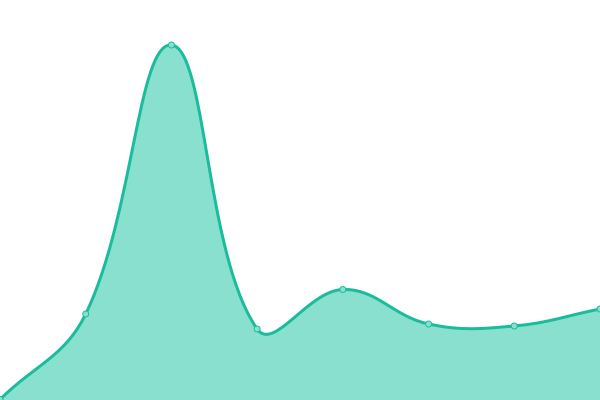

# [📈 Live Status](https://status.quicksales.vn): <!--live status--> **🟩 All systems operational**

This repository contains the open-source uptime monitor and status page for [chatquick](https://status.quicksales.vn), powered by [Upptime](https://github.com/upptime/upptime).

With [Upptime](https://upptime.js.org), you can get your own unlimited and free uptime monitor and status page, powered entirely by a GitHub repository. We use [Issues](https://github.com/chatquick/status/issues) as incident reports, [Actions](https://github.com/chatquick/status/actions) as uptime monitors, and [Pages](https://status.quicksales.vn) for the status page.

<!--start: status pages-->
<!-- This summary is generated by Upptime (https://github.com/upptime/upptime) -->
<!-- Do not edit this manually, your changes will be overwritten -->
<!-- prettier-ignore -->
| URL | Status | History | Response Time | Uptime |
| --- | ------ | ------- | ------------- | ------ |
|  [Quicksales](https://www.quicksales.vn) | 🟩 Up | [quicksales.yml](https://github.com/chatquick/status/commits/HEAD/history/quicksales.yml) | 

 711ms
     
 | 

<a href="https://status.quicksales.vn/history/quicksales">100.00%</a>
    

|  [Quickchat](https://chat.quicksales.vn) | 🟩 Up | [quickchat.yml](https://github.com/chatquick/status/commits/HEAD/history/quickchat.yml) | 

 578ms
     
 | 

<a href="https://status.quicksales.vn/history/quickchat">100.00%</a>
    

|  [Quickchat Dev](https://dev.quicksales.vn) | 🟩 Up | [quickchat-dev.yml](https://github.com/chatquick/status/commits/HEAD/history/quickchat-dev.yml) | 

 635ms
     
 | 

<a href="https://status.quicksales.vn/history/quickchat-dev">100.00%</a>
    

|  [Quickchat App](https://app.quicksales.vn) | 🟩 Up | [quickchat-app.yml](https://github.com/chatquick/status/commits/HEAD/history/quickchat-app.yml) | 

 417ms
     
 | 

<a href="https://status.quicksales.vn/history/quickchat-app">100.00%</a>
    

<!--end: status pages-->

[**Visit our status website →**](https://status.quicksales.vn)

## 📄 License

- Powered by: [Upptime](https://github.com/upptime/upptime)
- Code: [MIT](./LICENSE) © [chatquick](https://status.quicksales.vn)
- Data in the `./history` directory: [Open Database License](https://opendatacommons.org/licenses/odbl/1-0/)
